# CylindTrack

**Depth-Aware Cylindrical Motion Modeling for Panoramic Multi-Object Tracking**  
Paper: [arXiv:2606.30097](https://arxiv.org/abs/2606.30097)

> CylindTrack is an online tracking-by-detection framework for panoramic multi-object tracking. It lifts planar ERP tracking into a depth-aware cylindrical state space, improving identity preservation and trajectory continuity when targets cross the 0/360-degree panorama boundary or undergo heavy occlusion.

<p align="center">
  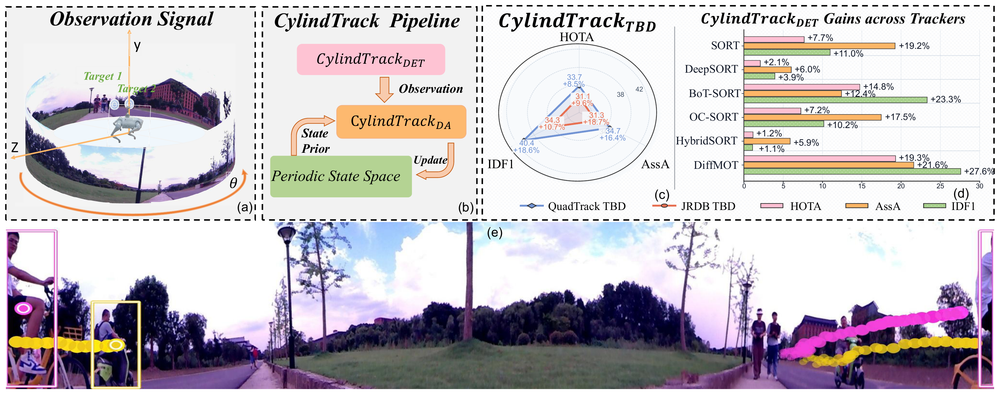
</p>

## Paradigm

Conventional TBD trackers usually predict motion and associate detections in planar UV image coordinates. This assumption breaks in equirectangular panoramic images: the left and right image borders are far apart in pixels, but adjacent in the real 360-degree scene. When a target crosses the ERP seam, direct UV modeling can produce an artificial large displacement, unreliable IoU overlap, trajectory fragmentation, and ID switches.

CylindTrack changes the paradigm from **planar UV tracking** to **depth-aware cylindrical tracking**:

- map the horizontal box center `x` to a longitude angle `theta`;
- maintain `theta` as an unwrapped continuous Kalman state across the 0/360-degree seam;
- compute overlap in a horizontal-periodic domain rather than with ordinary image-plane IoU;
- maintain depth as a temporally filtered trajectory-level state;
- combine topology-aware overlap, depth consistency, angular consistency, and detection confidence for online assignment.

<p align="center">
  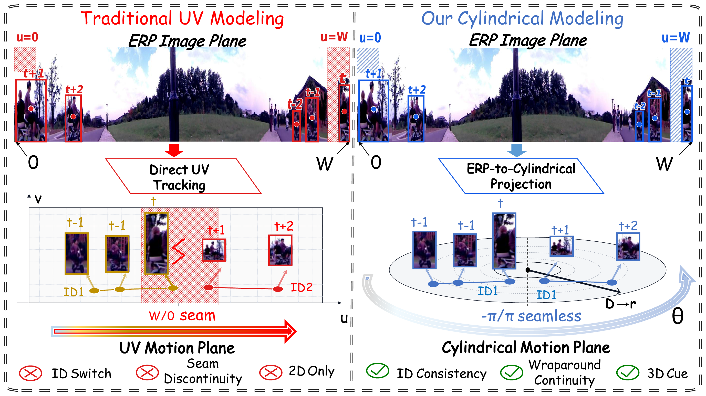
</p>

## Method

**DTM: Depth-Temporal Trajectory Modeling.**  
CylindTrack does not directly compare raw frame-wise depth between adjacent detections. Instead, each trajectory keeps a 1D constant-velocity depth Kalman state. This turns noisy monocular depth observations into a smoother trajectory-level geometric cue, which helps association under occlusion and close target interactions.

**SSTC: Spherical Spatio-Temporal Consistency Learning.**  
The detector-side module refines depth-aware instance queries with a query-based Temporal Mixer and Spherical Geometry-aware Attention. The Temporal Mixer reduces short-term depth fluctuations, while SGA injects ERP spherical geometry priors into depth prediction.

<p align="center">
  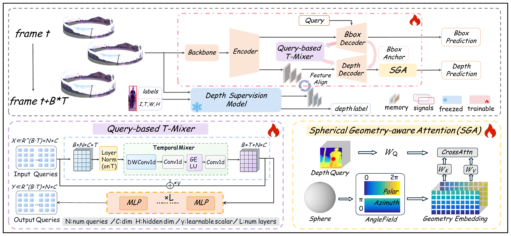
</p>

**TCMM: Topology-Aware Cylindrical Motion Model.**  
TCMM replaces ordinary Cartesian horizontal motion with a continuous angular state:

```text
m = (theta, y, a, h, theta_dot, y_dot, a_dot, h_dot)
theta = 2*pi*(x_center / W - 1/2)
```

During association, CylindTrack uses horizontal-periodic pixel-vertical IoU, DTM depth consistency, angular consistency, and confidence fusion. The design preserves seam continuity while remaining compatible with lightweight online TBD trackers such as ByteTrack-style two-stage matching.

<p align="center">
  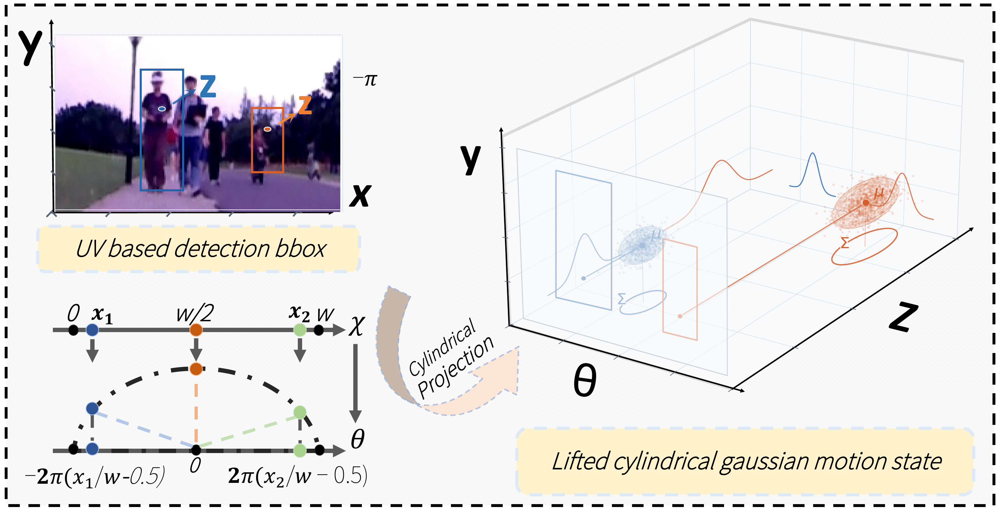
</p>

## Visualizations

The following animated visualizations replace the previous static qualitative panels. They show normal-scene comparisons, depth-related association behavior, and boundary-crossing cases where cylindrical modeling preserves trajectory continuity across panoramic seams.

### Obstruction Scene Comparisons

**JRDB: nvidia-aud-2019-01-25_0**

<p align="center">
  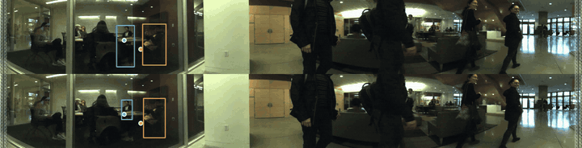
</p>


**QuadTrack: sequence 0009**

<p align="center">
  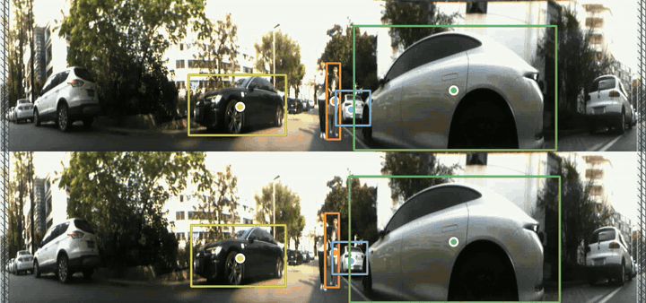
</p>

**QuadTrack: sequence 0012**

<p align="center">
  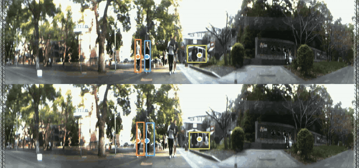
</p>

### Boundary Crossing Scene Comparisons
<table>
  <tr>
    <td width="33%" align="center">
      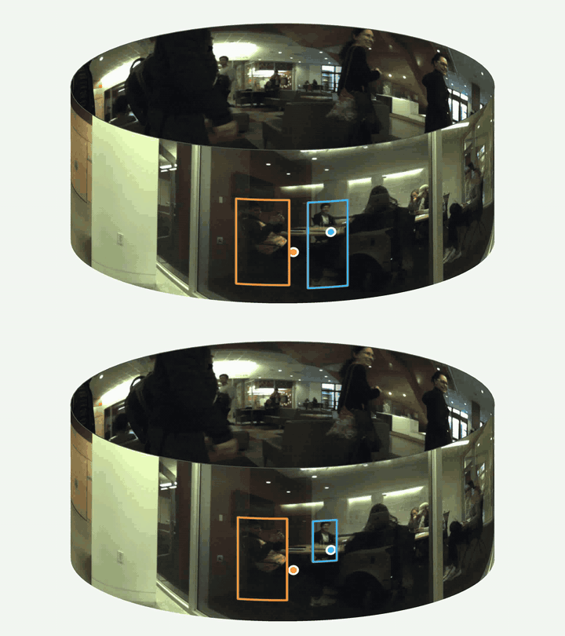
      <br><sub>JRDB CylindTrack Comparison</sub>
    </td>
    <td width="33%" align="center">
      
      <br><sub>Depth: JRDB nvidia-aud</sub>
    </td>
    <td width="33%" align="center">
      
      <br><sub>Depth: JRDB tressider</sub>
    </td>
  </tr>
  <tr>
    <td width="33%" align="center">
      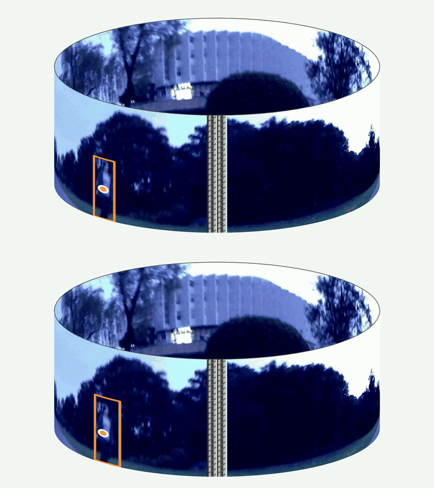
      <br><sub>Boundary Crossing: QuadTrack 0005</sub>
    </td>
    <td width="33%" align="center">
      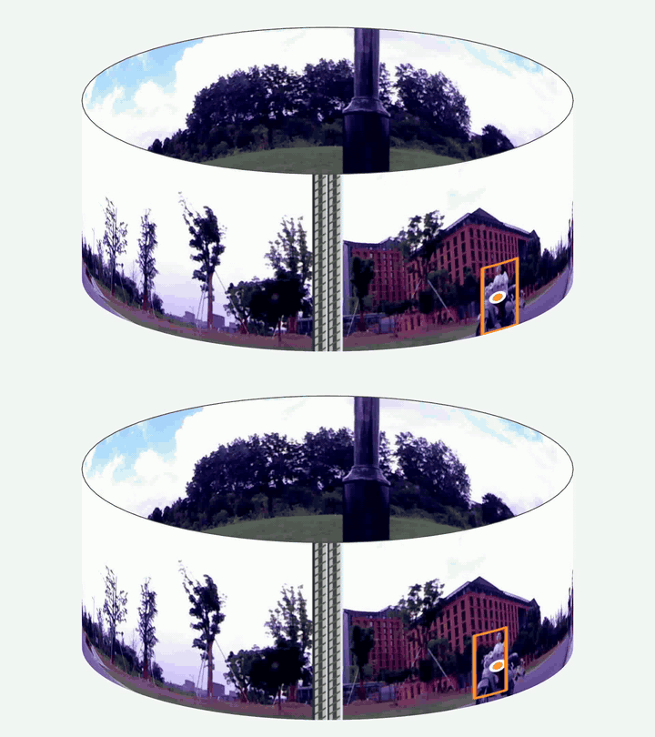
      <br><sub>Boundary Crossing: QuadTrack 0006</sub>
    </td>
    <td width="33%" align="center">
      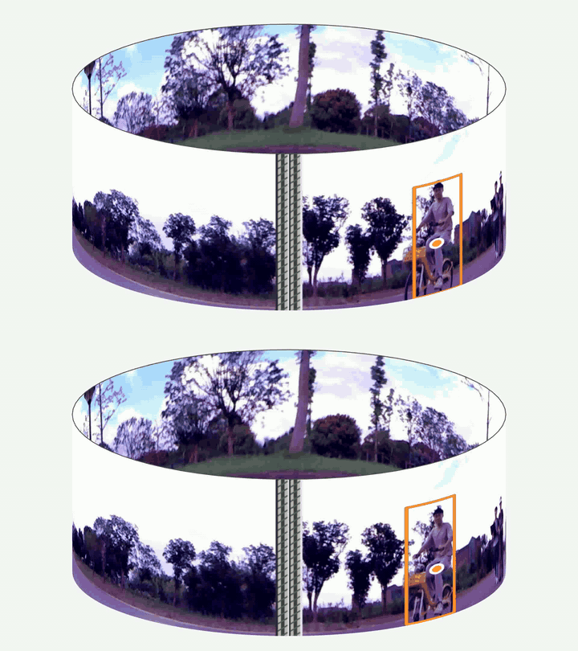
      <br><sub>Boundary Crossing: QuadTrack 0008</sub>
    </td>
  </tr>
</table>

Tracking results:

| Dataset | HOTA | BCIC | IDF1 | AssA | MOTA | FPS |
| --- | ---: | ---: | ---: | ---: | ---: | ---: |
| QuadTrack | 33.674 | 54.957 | 40.446 | 34.665 | 20.583 | 28.56 |
| JRDB | 31.117 | 35.365 | 34.331 | 31.347 | 31.219 | 21.34 |

BCIC denotes Boundary Crossing Identity Consistency, a local identity-preservation metric around seam-crossing events. Compared with the strongest baseline, CylindTrack improves BCIC by 24.38 points on QuadTrack and 13.51 points on JRDB.

## TODO

- Release training, inference, and evaluation code.
- Release model checkpoints and detector weights.
- Add dataset preparation scripts for QuadTrack and JRDB.
- Add reproduction configs for the reported ablation studies.
- Extend DTM toward camera-motion-aware depth filtering.
- Support broader 360-degree tracking scenarios with more sensors and object categories.

## Citation

```bibtex
@article{deng2026cylindtrack,
  title={CylindTrack: Depth-Aware Cylindrical Motion Modeling for Panoramic Multi-Object Tracking},
  author={Deng, Buyin and Luo, Kai and Huang, Lingxin and Liu, Xinqi and Cheng, Fei and Zheng, Hang and Yin, Liming and Yang, Kailun},
  journal={arXiv preprint arXiv:2606.30097},
  year={2026}
}
```
