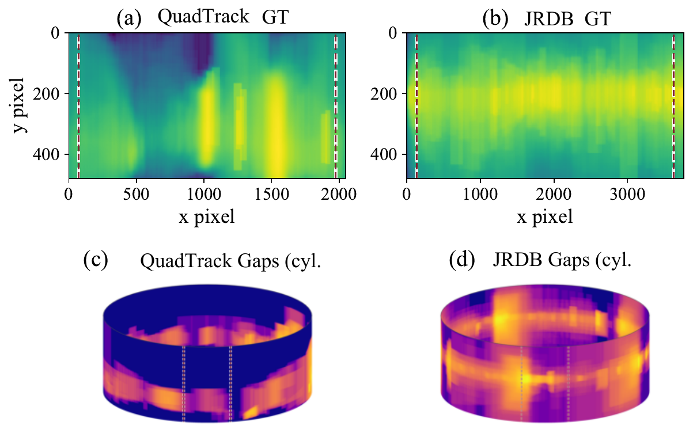
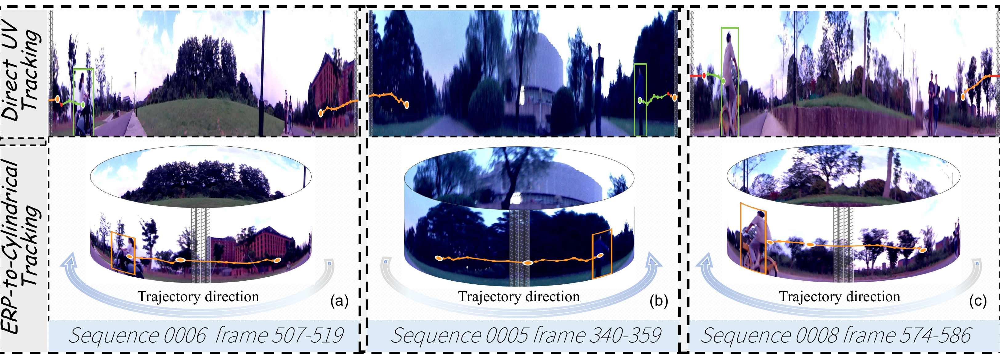
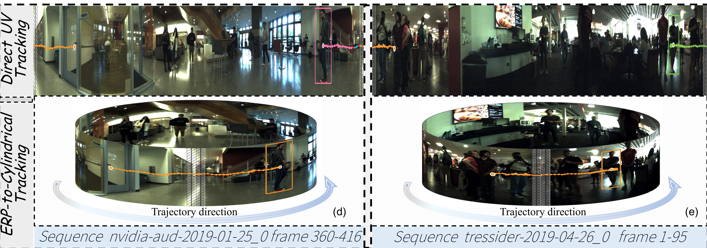
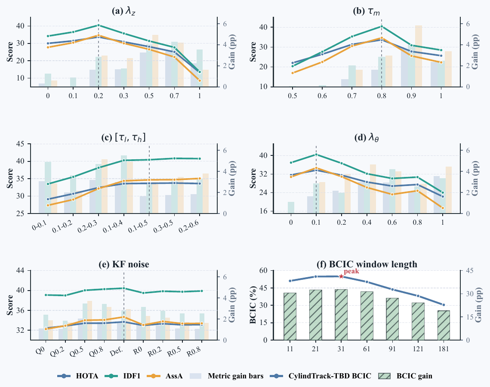

# CylindTrack

**Depth-Aware Cylindrical Motion Modeling for Panoramic Multi-Object Tracking**  
Paper: [arXiv:2606.30097](https://arxiv.org/abs/2606.30097)

> CylindTrack 是一个面向全景多目标跟踪的在线 tracking-by-detection 框架。它将 ERP 图像上的平面跟踪提升到带深度状态的圆柱拓扑空间，在目标跨越 0/360 度全景边界、遮挡和二维观测歧义时提升身份保持与轨迹连续性。

<p align="center">
  
</p>

## 范式解释

传统 TBD 跟踪器通常在平面 UV 图像坐标中做运动预测和数据关联。这个假设在等距矩形全景图像中会失效：图像左右边界在像素坐标中相距很远，但在真实 360 度场景中是相邻的。目标跨越 ERP 接缝时，普通 UV 建模会产生异常大的位移、错误的 IoU 重叠、轨迹断裂和 ID switch。

CylindTrack 将跟踪范式从 **平面 UV tracking** 改为 **深度感知的圆柱 tracking**：

- 将检测框水平中心 `x` 映射为经度角 `theta`；
- 在 Kalman 状态中维护不折返的连续 `theta`，跨 0/360 度边界时保持运动连续；
- 在水平周期域中计算重叠，而不是直接使用普通图像平面 IoU；
- 将深度作为轨迹级时序状态进行滤波，提供更稳定的空间线索；
- 用拓扑重叠、深度一致性、角度一致性和检测置信度共同完成在线匹配。

<p align="center">
  
</p>

## 方法简介

**DTM: Depth-Temporal Trajectory Modeling.**  
不再直接比较相邻帧的单帧深度，而是为每条轨迹维护一维常速度深度 Kalman 状态。这样可以把噪声较大的单目深度变成更平滑的轨迹级几何约束，帮助处理遮挡和近距离目标交互。

**SSTC: Spherical Spatio-Temporal Consistency Learning.**  
检测器侧模块通过 query-based Temporal Mixer 和 Spherical Geometry-aware Attention 优化深度感知实例查询。Temporal Mixer 用于降低短时深度波动，SGA 将 ERP 球面几何先验注入深度预测。

<p align="center">
  
</p>

**TCMM: Topology-Aware Cylindrical Motion Model.**  
TCMM 用连续角度状态替代普通笛卡尔水平坐标运动：

```text
m = (theta, y, a, h, theta_dot, y_dot, a_dot, h_dot)
theta = 2*pi*(x_center / W - 1/2)
```

关联阶段使用 horizontal-periodic pixel-vertical IoU、DTM 深度一致性、角度一致性和置信度融合。该设计保持接缝连续性，同时兼容 ByteTrack 式两阶段匹配等轻量在线 TBD 跟踪器。

<p align="center">
  
</p>

## 可视化图表

下图展示了为什么全景跟踪需要拓扑一致的关联：标注缺口与歧义观测集中出现在左右接缝和遮挡区域。

<p align="center">
  
</p>

定性可视化显示，当同一目标出现在 ERP 左右边界附近时，圆柱建模可以保持连续轨迹，而直接 UV 跟踪更容易产生断裂。

<p align="center">
  
</p>

<p align="center">
  
</p>

论文报告的 depth-enabled 主结果：

| Dataset | HOTA | BCIC | IDF1 | AssA | MOTA | FPS |
| --- | ---: | ---: | ---: | ---: | ---: | ---: |
| QuadTrack | 33.674 | 54.957 | 40.446 | 34.665 | 20.583 | 28.56 |
| JRDB | 31.117 | 35.365 | 34.331 | 31.347 | 31.219 | 21.34 |

BCIC 表示 Boundary Crossing Identity Consistency，用于衡量接缝跨越事件附近的局部身份一致性。相较最强 DepTR-MOT + ByteTrack baseline，CylindTrack 在 QuadTrack 上提升 24.38 个 BCIC 点，在 JRDB 上提升 13.51 个 BCIC 点。

<p align="center">
  
</p>

## TODO

- 发布训练、推理与评测代码。
- 发布模型 checkpoint 和检测器权重。
- 补充 QuadTrack 与 JRDB 的数据准备脚本。
- 补充论文消融实验的复现配置。
- 将 DTM 扩展到 camera-motion-aware depth filtering。
- 支持更多 360 度跟踪场景、传感器类型和目标类别。

## Citation

```bibtex
@article{deng2026cylindtrack,
  title={CylindTrack: Depth-Aware Cylindrical Motion Modeling for Panoramic Multi-Object Tracking},
  author={Deng, Buyin and Luo, Kai and Huang, Lingxin and Liu, Xinqi and Cheng, Fei and Zheng, Hang and Yin, Liming and Yang, Kailun},
  journal={arXiv preprint arXiv:2606.30097},
  year={2026}
}
```
